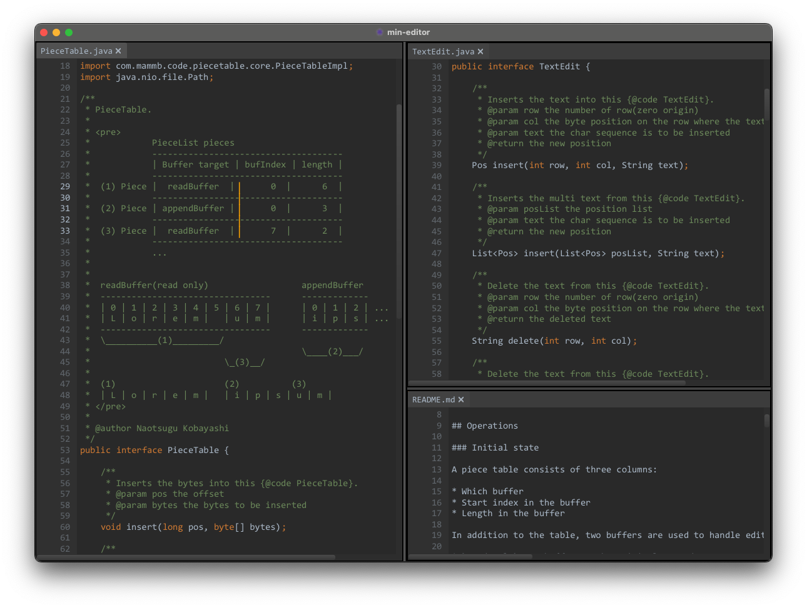

# Min Editor

A minimal text editor, currently **under development**.

- A minimal text editor, not an IDE.
- Implemented with JavaFX, as it is one of the few languages with a standard multi-platform UI toolkit.
- It uses a piece table data structure, allowing it to handle large files without significant memory allocation.




## Features

- Syntax highlighting
- Line wrapping
- Multiple tab support
- Multiple carets and selections
- Handles large files efficiently
- CSV/TSV layout mode
- Various editing commands (Open the command palette with `⌘-P` or `Ctrl-P`)


## Installing

Download the latest [min-editor release](https://github.com/naotsugu/min-editor/releases) and unzip it.
Launch the application by running the executable file.

### Launching on macOS

By default, macOS only allows applications from the official App Store.

If you can't run the downloaded application, you may need to remove the quarantine attribute.
This will bypass the security warning.

1.  Open a Terminal window.
2.  Run the following command:

```shell
sudo xattr -r -d com.apple.quarantine /Applications/min-editor.app
```

## Uninstalling

To uninstall, simply delete the application and its configuration files.

Configuration files are located in the following directories for each platform:

| platform | location                                    |
|----------|---------------------------------------------|
| max os   | `~/Library/Application Support/min-editor/` |
| linux    | `~/.config/min-editor/`                     |
| windows  | `~/AppData/Local/min-editor/`               |


## Building

To build the application from source, run the following commands:

```shell
git clone --recursive https://github.com/naotsugu/min-editor.git
cd min-editor
./gradlew clean pkg
```

You can run the generated binary with the following command:

```shell
./modules/bootstrap/build/jpackage/min-editor/min-editor
```
The distribution archive will be created in the `/modules/bootstrap/build/distributions/` directories.

To run the application directly from the source, use:

```shell
./gradlew run
```

To run in debug mode:

```shell
./gradlew run -Ddebug
```

This repository contains git submodules.
To update them, run:

```shell
git submodule update --remote --merge
```

To format the code, run:

```shell
./gradlew rewriteRun
```
